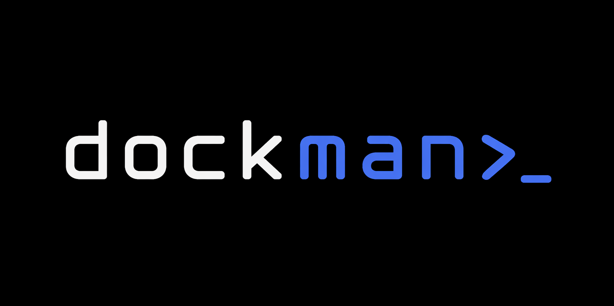

# dockman>_

<p align="center">
  
</p>

<p align="center">
  <strong>Personal Docker &amp; Media Server Management Tool</strong>
</p>

<p align="center">
  
  
  
  
</p>

---

Dockman adalah TUI (Terminal User Interface) berbasis Python untuk mengelola Docker container, images, compose, GNU Screen, rclone, dan laporan server — semuanya dari satu tempat, langsung di terminal.

---

## 📸 Screenshot

<p align="center">
  
</p>

---

## ✨ Fitur

- **TUI Interaktif** — navigasi keyboard, anti-flicker, shortcut huruf `[X]`
- **Dashboard Home** — neofetch-style: sysinfo, RAM, storage bar, block devices, docker summary
- **Manajemen Container** — lihat logs, live logs, restart, stop/start, exec shell, pull image, remove
- **Bulk Actions** — update semua image, restart semua, compose up/down/pull, prune volumes/images
- **Docker Images** — list, pull update, hapus
- **Docker Compose** — view, edit, backup, validate config
- **GNU Screen** — list, attach, buat session baru, jalankan command di background, kill session
- **Extras** — kelola alias/bashrc, cron job viewer & editor, rclone copy dari cloud
- **Server Report** — generate dokumentasi server lengkap (hardware, storage, network, docker, cron, dll)
- **Settings** — konfigurasi semua parameter langsung dari TUI
- **Hybrid UI** — navigasi pakai Curses, output pakai Rich (tabel berwarna, syntax highlight, progress bar)

---

## 📦 Instalasi

```bash
bash <(curl -fsSL https://raw.githubusercontent.com/bugsdroid/dockman/main/install-dockman.sh)
```

Installer otomatis mengurus dependensi: Python3, pip, Rich, Docker, GNU Screen, rclone, nano.

| OS | Package Manager |
|---|---|
| Ubuntu / Debian / Mint | apt |
| Fedora | dnf |
| RHEL / CentOS / Rocky | yum |
| Arch / Manjaro | pacman |
| Alpine | apk |

### Update & Uninstall

```bash
# Update ke versi terbaru
bash <(curl -fsSL https://raw.githubusercontent.com/bugsdroid/dockman/main/install-dockman.sh)

# Uninstall
bash <(curl -fsSL https://raw.githubusercontent.com/bugsdroid/dockman/main/install-dockman.sh) uninstall

# Cek dependensi
bash <(curl -fsSL https://raw.githubusercontent.com/bugsdroid/dockman/main/install-dockman.sh) check
```

---

## 🚀 Penggunaan

```bash
dockman              # TUI interaktif (default)
dockman --menu       # Numbered menu (fallback)
dockman --setup      # Wizard konfigurasi awal
dockman --debug      # TUI + traceback jika error
dockman --version    # Versi
```

### CLI Commands (tanpa TUI)

```bash
dockman ps                # List semua container
dockman images            # List docker images
dockman stats             # Snapshot resource usage
dockman df                # Disk usage docker
dockman logs <name>       # Logs 50 baris terakhir
dockman logs <name> <n>   # Logs n baris
dockman live <name>       # Live streaming logs
dockman inspect <name>    # Inspect container (JSON)
dockman screens           # List GNU screen sessions
dockman report            # Generate server report
dockman report <path>     # Generate ke path custom
```

---

## ⌨️ Navigasi TUI

| Key | Aksi |
|---|---|
| `↑` / `k` | Naik |
| `↓` / `j` | Turun |
| `Enter` | Pilih / buka menu |
| `q` / `Esc` | Kembali / keluar |
| `r` | Refresh container |
| `a` | Aksi semua container |
| `i` | Daftar images |
| `s` | Docker stats |
| `d` | Disk usage |
| `c` | Docker Compose |
| `x` | Extras (alias, cron, rclone, report) |
| `w` | GNU Screen manager |
| `t` | Settings / konfigurasi |
| `?` | Help |

> **Tip:** Di setiap menu, item dengan `[X]` bisa dipilih langsung dengan menekan huruf tersebut.

---

## ⚙️ Konfigurasi

Config disimpan di `~/.config/dockman/config.ini`.

```ini
[general]
editor          = nano
hostname        = myserver
fetch_interval  = 10
doc_output_dir  = /home/user

[docker]
compose_file    = /mnt/media/docker-compose.yml
compose_dir     = /mnt/media
compose_cmd     = docker compose

[rclone]
remote_name     = mega
remote_path     = film
dest_radarr     = /mnt/media/downloads/complete/radarr
dest_sonarr     = /mnt/media/downloads/complete/sonarr

[alias]
file            = /home/user/.bashrc
```

Saat pertama kali dijalankan, wizard setup akan berjalan otomatis.

---

## 📋 Releases

| Versi | Tanggal | Keterangan |
|---|---|---|
| [v2.2.0](https://github.com/bugsdroid/dockman/releases/tag/v2.2.0) | 2026-04-28 | Home Dashboard, banner animasi, remote install |
| v2.1.0 | 2026-04-20 | GNU Screen, rclone, server report, wizard |
| v2.0.0 | 2026-04-10 | Hybrid UI (Curses + Rich), CLI commands |
| v1.0.0 | 2026-03-01 | Versi pertama |

Lihat [CHANGELOG.md](CHANGELOG.md) untuk detail perubahan setiap versi.

---

## 📁 Lokasi File

| File | Path |
|---|---|
| Binary | `/usr/local/bin/dockman` |
| Config | `~/.config/dockman/config.ini` |
| Server Report | `<doc_output_dir>/server-docs-YYYYMMDD.txt` |
| Backup binary | `/usr/local/bin/dockman.bak_YYYYMMDD_HHMMSS` |

---

## 🛠️ Development

```bash
git clone https://github.com/bugsdroid/dockman.git
cd dockman
pip install rich --break-system-packages

# Edit source
nano dockman_main/ui/curses_ui.py

# Build single file
cd dockman_main
python3 build.py
# Output: dist/dockman.py

# Test tanpa install
python3 dist/dockman.py --version
python3 dist/dockman.py ps

# Install untuk test TUI
sudo cp dist/dockman.py /usr/local/bin/dockman
dockman
```

### Arsitektur

```
dockman/
├── dockman_main/       # Source code
│   ├── core/           # Business logic (tanpa UI)
│   │   ├── config.py
│   │   ├── docker.py
│   │   ├── utils.py
│   │   └── serverdocs.py
│   ├── ui/             # UI layer
│   │   ├── curses_ui.py   # TUI interaktif
│   │   ├── rich_ui.py     # Output tabel & logs
│   │   ├── cli_menu.py    # Numbered menu fallback
│   │   └── wizard.py      # Setup wizard
│   ├── main.py
│   └── build.py
├── dockman.py          # Pre-built single file (siap install)
├── install-dockman.sh  # Universal installer
├── image-assets/       # Logo & screenshot
├── CHANGELOG.md
└── TECHNICAL.md
```

**Aturan:** `core/` tidak boleh import dari `ui/`. Build system meng-compile semua file menjadi satu `dockman.py`.

---

## 📋 Dependensi

- Python 3.8+
- [Rich](https://github.com/Textualize/rich) — output terminal yang indah
- Docker Engine
- GNU Screen
- rclone *(opsional, untuk fitur cloud copy)*
- nano *(atau editor lain)*

---

## 📄 Lisensi

MIT License — bebas digunakan dan dimodifikasi.

---

*Dibuat untuk personal media server. Tested di Ubuntu/Debian.*
